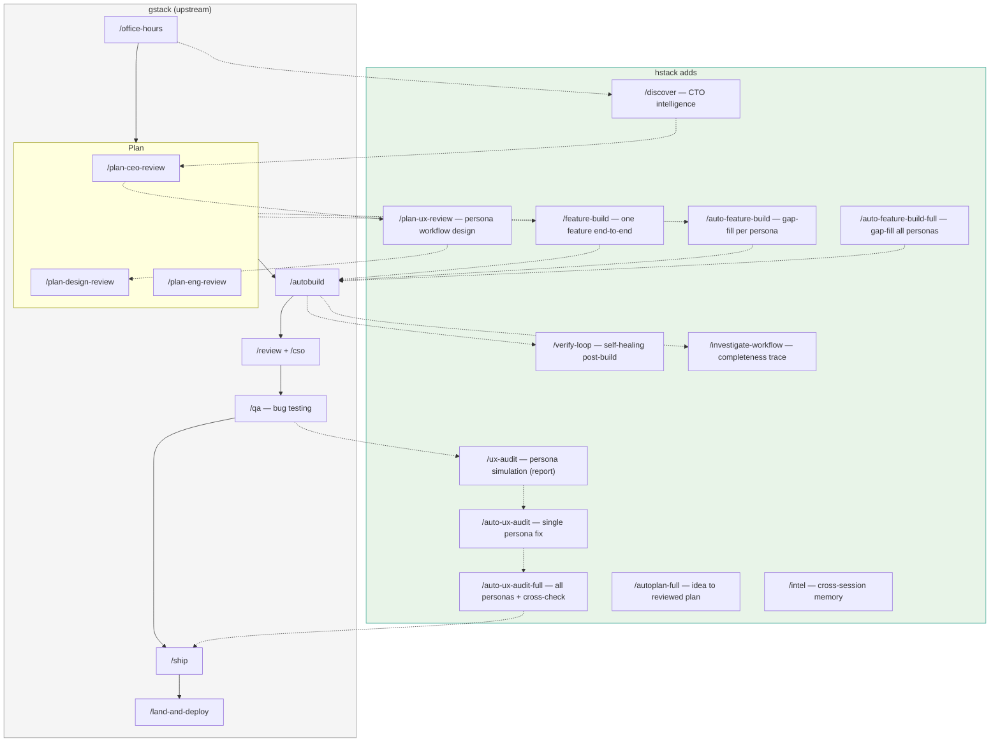
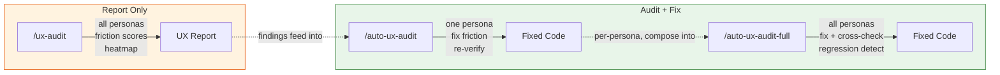
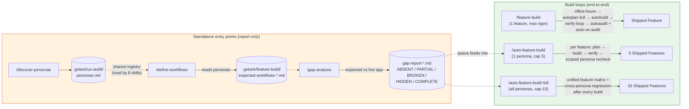

# hstack (Hall Stack)

**A CTO's software factory for Claude Code** — derived from [garrytan/gstack](https://github.com/garrytan/gstack), extended with research-grade intelligence.

Hi, I'm [Hall](https://x.com/atlonxp). I'm a CTO building AI products — from computer vision to financial ML to multiagent systems — and right now I am in the middle of something that feels like a new era entirely.

I forked [Garry Tan's gstack](https://github.com/garrytan/gstack) — his open source software factory that turns Claude Code into a virtual engineering team — and I'm making it better. Not because gstack was broken, but because a CTO who has spent years building AI systems sees gaps that a general-purpose toolkit doesn't cover. Stakeholder workflows that span multiple personas. Technology landscape intelligence that recommends with conviction, not menus. The kind of thinking a research-trained technologist brings to product development.

**What hstack adds on top of gstack:**

- **`/ux-audit`** — Persona-driven UX workflow audit on a live site. Defines personas, scripts their end-to-end workflows, executes them in the browser, and reports where each persona gets stuck, confused, or hits dead ends. Scores every step on 5 UX dimensions (Findability, Clarity, Feedback, Recovery, Speed). Friction heatmap across all personas. 1-second Playwright timeout for local dev speed.

- **`/auto-ux-audit`** — Single-persona UX audit with auto-fix. Runs `/ux-audit` for one specified persona, then fixes every friction point in source code with atomic commits and browser re-verification. Like `/qa` but for UX friction instead of bugs.

- **`/auto-ux-audit-full`** — Full UX audit across all personas with auto-fix. Discovers or accepts personas, audits each one sequentially, fixes friction, then runs **cross-persona verification** — ensures fixes for one persona don't break another's experience. The skill that doesn't exist anywhere else.

- **`/feature-build`** — Manual single-feature builder. You hand it ONE feature; it takes it end-to-end: optional office-hours framing → autoplan-full → autobuild → verify-loop → scoped persona verification → autoaudit + auto-ux-audit. One feature, maximum rigor.

- **`/auto-feature-build`** — Single-persona feature gap-filler. Picks one persona, derives what they *should* be able to do, compares against the live app with a 5-signal completeness rubric, builds a dependency-ordered queue of missing features, and walks plan → build → verify → scoped re-check for each one. Cap: 5 features per run. Resumable via a durable queue file.

- **`/auto-feature-build-full`** — All-persona feature gap-filler. Loops gap analysis across every persona, dedupes features into a unified matrix (one feature that serves N personas = one build), topologically sorts, then runs the per-feature loop with **cross-persona regression verification** after each build. Cap: 10 features per run.

- **`/discover-personas`**, **`/define-workflows`**, **`/gap-analysis`** — Standalone entry points to the feature-build pipeline. Discover personas, derive expected workflows, and run the completeness gap analysis without committing to the full build loop.

- **`/plan-ux-review`** — UX researcher-mode plan review. Maps multi-persona workflows, handoff points, business process state machines, and permission divergence. Seven passes, each rated 0-10. Catches the gaps that single-user reviews miss: what happens when the approver is on vacation? What does the admin see vs the end user? Where do workflows break between personas?

- **`/discover`** — CTO-mode technology & product intelligence. Scans competitors, scouts emerging tech, finds market gaps, delivers build-vs-buy analysis with Wardley mapping. Not a report generator — a visionary CTO who synthesizes and recommends with conviction. Every recommendation includes a 30-minute proof-of-concept plan.

- **`/autoplan-full`** — The complete CTO planning pipeline in one command. Runs office-hours → discover → CEO → UX → design → eng review. Interactive for framing (phases 1-2), auto-decided for reviews (phases 3-6). Two human gates: confirm framing, approve final plan.

- **`/autobuild`** — Autonomous implementation from an approved plan. Reads the plan, extracts implementation steps, builds everything with full autonomy. Optional checkpoints for review between components.

- **`/autoaudit`** — Post-build verification. Runs security audit (CSO) then code review (review + codex). Auto-fixes obvious issues, flags ambiguous ones. Clear pass/fail verdict. No shipping — that's your call.

- **`/verify-loop`** — Self-healing verification loop. After building, traces every code path, auto-fixes BROKEN items, presents INCOMPLETE items for your decision. Max 3 iterations with regression detection — if a fix breaks something new, it stops immediately.

- **`/intel`** — Project intelligence briefing. Reads cross-session memory from findings logged by review, CSO, and investigate skills. Shows hotspot files, recurring patterns, and trends. Run at session start to get up to speed.

- **`/check-ci`**, **`/check-deps`**, **`/check-issues`** — One-shot status checks. CI status via `gh`/`glab`, dependency audit via `npm audit`/`pip audit`/etc., issue triage with priority categorization. No daemons — run when you need them.

**hstack is gstack + a CTO's lens.** Same foundation. Same MIT license. All the upstream specialists plus the ones that make the team complete. Built on the shoulders of a giant — credit where it's due.

Fork it. Improve it. Make it yours.

**Who this is for:**
- **Founders and CEOs** — especially technical ones who still want to ship
- **First-time Claude Code users** — structured roles instead of a blank prompt
- **Tech leads and staff engineers** — rigorous review, QA, and release automation on every PR

## Quick start

1. Install hstack (30 seconds — see below)
2. Run `/autoplan-full` — describe your idea, get a fully reviewed plan (now with task checkboxes)
3. Run `/autobuild` — implement the plan (now with self-healing verify loop)
4. Run `/autoaudit` — verify security + code quality
5. Run `/auto-ux-audit-full` — simulate every persona's workflow, fix friction
6. Run `/ship` — when you're ready

Or go manual: `/office-hours` → `/discover` → `/plan-ceo-review` → `/plan-ux-review` → `/plan-design-review` → `/plan-eng-review` → build → `/review` → `/cso` → `/qa` → `/auto-ux-audit-full` → `/ship`.

## How hstack works

hstack extends gstack with **persona-aware UX intelligence** — the layer between "does it work?" (QA) and "can real humans accomplish their goals?" (UX audit). This is what makes hstack a CTO's tool, not just an engineer's tool.



### The UX audit pipeline

gstack answers "does it work?" — hstack also answers "can each persona accomplish their goal?"



### The feature-build pipeline

The UX audit family fixes friction in workflows that already exist. The feature-build family discovers and builds the workflows that *don't* exist yet. Same persona registry, opposite direction.



All three build loops are **resumable** — each one writes a durable `feature-queue-{datetime}.md` state file. If you ctrl-C or crash mid-run, re-running the skill detects the queue and offers to pick up from the exact row where you left off, across sessions.

### What makes this different

| Capability | gstack | hstack |
|-----------|--------|--------|
| Bug testing on live site | `/qa` | `/qa` |
| UX plan review (pre-build) | - | `/plan-ux-review` |
| Persona simulation on live site | - | `/ux-audit` |
| Auto-fix UX friction per persona | - | `/auto-ux-audit` |
| Cross-persona regression detection | - | `/auto-ux-audit-full` |
| Technology landscape intelligence | - | `/discover` |
| Full CTO planning pipeline | - | `/autoplan-full` |
| Single-feature end-to-end pipeline | - | `/feature-build` |
| Auto-discover MISSING features (per persona) | - | `/auto-feature-build` |
| Auto-discover MISSING features (all personas) | - | `/auto-feature-build-full` |
| Workflow completeness gap analysis | - | `/gap-analysis` |
| Post-build workflow investigator | - | `/investigate-workflow` |
| Self-healing verify loop after build | - | `/verify-loop` |
| Post-build security + review pipeline | - | `/autoaudit` |
| One-shot CI / deps / issues checks | - | `/check-ci`, `/check-deps`, `/check-issues` |
| Cross-session project memory | - | `/intel` |
| Configurable Playwright timeout | - | `BROWSE_CMD_TIMEOUT` env var |

The UX audit skills use a **5-dimension friction scoring system** (Findability, Clarity, Feedback, Recovery, Speed) evaluated at every step of every workflow for every persona. This isn't "does the button work" — it's "would a first-time user find the button, understand what it does, see confirmation after clicking it, and recover if they clicked the wrong one?"

The feature-build family uses a **5-signal completeness rubric** (route, form, handler, persist, feedback) to answer a different question: not "is this feature built well?" but "which features is the app missing entirely?" For each persona, it derives the workflows they *should* be able to accomplish, compares against what the live app actually supports, and builds the missing ones in dependency order.

## Install — 30 seconds

**Requirements:** [Claude Code](https://docs.anthropic.com/en/docs/claude-code), [Git](https://git-scm.com/), [Bun](https://bun.sh/) v1.0+, [Node.js](https://nodejs.org/) (Windows only)

### Step 1: Install on your machine

Open Claude Code and paste this. Claude does the rest.

> Install hstack: run **`git clone --single-branch --depth 1 https://github.com/atlonxp/hstack.git ~/.claude/skills/hstack && cd ~/.claude/skills/hstack && ./setup`** then add an "hstack" section to CLAUDE.md that says to use the /browse skill from hstack for all web browsing, never use mcp\_\_claude-in-chrome\_\_\* tools, and lists the available skills: /office-hours, /discover, /plan-ceo-review, /plan-eng-review, /plan-design-review, /plan-ux-review, /plan-devex-review, /plan-tune, /design-consultation, /design-shotgun, /design-html, /review, /ship, /land-and-deploy, /canary, /benchmark, /benchmark-models, /browse, /connect-chrome, /open-gstack-browser, /pair-agent, /make-pdf, /qa, /qa-only, /design-review, /devex-review, /scrape, /skillify, /setup-browser-cookies, /setup-deploy, /setup-gbrain, /retro, /investigate, /investigate-workflow, /document-release, /codex, /cso, /autoplan, /autoplan-full, /autobuild, /autoaudit, /verify-loop, /intel, /check-ci, /check-deps, /check-issues, /learn, /ux-audit, /auto-ux-audit, /auto-ux-audit-full, /feature-build, /auto-feature-build, /auto-feature-build-full, /discover-personas, /define-workflows, /gap-analysis, /context-save, /context-restore, /health, /careful, /freeze, /guard, /unfreeze, /gstack-upgrade. Then ask the user if they also want to add hstack to the current project so teammates get it.

### Step 2: Add to your repo so teammates get it (optional)

> Add hstack to this project: run **`cp -Rf ~/.claude/skills/hstack .claude/skills/hstack && rm -rf .claude/skills/hstack/.git && cd .claude/skills/hstack && ./setup`** then add an "hstack" section to this project's CLAUDE.md that says to use the /browse skill from hstack for all web browsing, never use mcp\_\_claude-in-chrome\_\_\* tools, lists the available skills: /office-hours, /discover, /plan-ceo-review, /plan-eng-review, /plan-design-review, /plan-ux-review, /plan-devex-review, /plan-tune, /design-consultation, /design-shotgun, /design-html, /review, /ship, /land-and-deploy, /canary, /benchmark, /benchmark-models, /browse, /connect-chrome, /open-gstack-browser, /pair-agent, /make-pdf, /qa, /qa-only, /design-review, /devex-review, /setup-browser-cookies, /setup-deploy, /retro, /investigate, /investigate-workflow, /document-release, /codex, /cso, /autoplan, /autoplan-full, /autobuild, /autoaudit, /verify-loop, /intel, /check-ci, /check-deps, /check-issues, /learn, /ux-audit, /auto-ux-audit, /auto-ux-audit-full, /feature-build, /auto-feature-build, /auto-feature-build-full, /discover-personas, /define-workflows, /gap-analysis, /context-save, /context-restore, /health, /careful, /freeze, /guard, /unfreeze, /gstack-upgrade, and tells Claude that if hstack skills aren't working, run `cd .claude/skills/hstack && ./setup` to build the binary and register skills.

Real files get committed to your repo (not a submodule), so `git clone` just works. Everything lives inside `.claude/`. Nothing touches your PATH or runs in the background.

> **Contributing or need full history?** The commands above use `--depth 1` for a fast install. If you plan to contribute or need full git history, do a full clone instead:
> ```bash
> git clone https://github.com/atlonxp/hstack.git ~/.claude/skills/hstack
> ```

### Codex, Gemini CLI, or Cursor

hstack works on any agent that supports the [SKILL.md standard](https://github.com/anthropics/claude-code). Skills live in `.agents/skills/` and are discovered automatically.

Install to one repo:

```bash
git clone --single-branch --depth 1 https://github.com/atlonxp/hstack.git .agents/skills/hstack
cd .agents/skills/hstack && ./setup --host codex
```

When setup runs from `.agents/skills/hstack`, it installs the generated Codex skills next to it in the same repo and does not write to `~/.codex/skills`.

Install once for your user account:

```bash
git clone --single-branch --depth 1 https://github.com/atlonxp/hstack.git ~/hstack
cd ~/hstack && ./setup --host codex
```

`setup --host codex` creates the runtime root at `~/.codex/skills/hstack` and
links the generated Codex skills at the top level. This avoids duplicate skill
discovery from the source repo checkout.

Or let setup auto-detect which agents you have installed:

```bash
git clone --single-branch --depth 1 https://github.com/atlonxp/hstack.git ~/hstack
cd ~/hstack && ./setup --host auto
```

For Codex-compatible hosts, setup now supports both repo-local installs from `.agents/skills/hstack` and user-global installs from `~/.codex/skills/hstack`. All skills work across all supported agents. Hook-based safety skills (careful, freeze, guard) use inline safety advisory prose on non-Claude hosts.

### Factory Droid

hstack works with [Factory Droid](https://factory.ai). Skills install to `.factory/skills/` and are discovered automatically. Sensitive skills (ship, land-and-deploy, guard) use `disable-model-invocation: true` so Droids don't auto-invoke them.

```bash
git clone --single-branch --depth 1 https://github.com/atlonxp/hstack.git ~/hstack
cd ~/hstack && ./setup --host factory
```

Skills install to `~/.factory/skills/hstack-*/`. Restart `droid` to rescan skills, then type `/qa` to get started.

### Voice input (AquaVoice, Whisper, etc.)

hstack skills have voice-friendly trigger phrases. Say what you want naturally —
"run a security check", "test the website", "do an engineering review", "audit the UX" — and the
right skill activates. You don't need to remember slash command names or acronyms.

## Zero to MVP — the full journey

This is what a complete product cycle looks like with hstack. Every skill feeds into the next. Nothing falls through the cracks because every step knows what came before it.

### Phase 1: Think — define the problem before you solve it

```
You:    /office-hours
        "I want to build a daily briefing app for my calendar."

Claude: I'm going to push back on the framing. You said "daily briefing
        app." But what you actually described is a personal chief of staff AI.
        [six forcing questions — extracts the real pain]
        [challenges 4 premises — you agree, disagree, or adjust]
        [generates 3 implementation approaches with effort estimates]
        → writes design doc that feeds into every downstream skill
```

### Phase 2: Discover — research the landscape before you design

```
You:    /discover
        [reads your design doc from /office-hours]
        [scans competitors, scouts emerging tech, finds market gaps]
        [delivers build-vs-buy analysis with Wardley mapping]
        → writes research brief: "Use X for auth, build Y yourself, skip Z — here's why"
        → each recommendation includes a 30-minute proof-of-concept plan
```

### Phase 3: Plan — review from every angle before you write code

You can run each review manually for full control, or use `/autoplan` to run them all automatically.

**Manual approach** (recommended when you want to make decisions at each step):

```
You:    /plan-ceo-review       → challenges scope, finds the 10-star product
You:    /plan-design-review    → rates every design dimension 0-10, catches AI slop
You:    /plan-ux-review        → maps multi-persona workflows, catches handoff gaps
You:    /plan-eng-review       → locks architecture, data flow, edge cases, test plan
```

**Fast approach** (when you trust the process):

```
You:    /autoplan              → runs CEO → design → eng review automatically
                                  surfaces only taste decisions for your approval
```

**Full autopilot** (hstack exclusive — idea to reviewed plan in one command):

```
You:    /autoplan-full         → runs office-hours → discover → CEO → UX → design → eng
                                  interactive for framing, auto-decided for reviews
                                  two gates: confirm framing, approve final plan
```

### Phase 4: Design — explore visual directions before you build

```
You:    /design-shotgun        → generates multiple AI design variants
                                  opens comparison board in your browser
                                  iterate until you approve a direction

You:    /design-html           → takes approved mockup and generates production HTML
                                  text reflows on resize, heights adjust to content
                                  framework detection for React/Svelte/Vue
```

### Phase 5: Build — approve the plan and let Claude write the code

**Path A — you know what to build.** Use this when you have a single clear feature or a full roadmap already decided.

```
You:    /autobuild             → reads the plan, builds everything autonomously
Claude: [implements component by component, tests alongside each one]
        [2,400 lines across 11 files, 9 new tests. ~8 minutes.]
```

Or `/feature-build` for one specific feature with maximum rigor — framing + plan + build + verify + audit, all in one pipeline.

**Path B — you don't know what to build yet.** Use this when you have a live app and personas but aren't sure which features are actually *missing*.

```
You:    /auto-feature-build-full http://localhost:3000
Claude: [reads .gstack/ux-audit/personas.md — 3 personas]
        [derives expected workflows per persona from goal + permissions]
        [compares expected vs live app with 5-signal completeness rubric]
        [unified feature matrix: 14 missing, 3 shared across personas]
        [topological sort by dependencies]

        Building feature 1/10: "Admin resets user password"
          plan → build → verify → scoped persona recheck → cross-persona regression
          → PASS for Admin, Member flows unaffected

        Building feature 2/10: "Member cancels subscription"
          ...
        [writes .gstack/feature-build/feature-queue-2026-04-20-1400.md as it goes]
        [if you ctrl-C, re-running resumes from the exact row you stopped at]
```

Or manually: "Approve plan. Exit plan mode." and let Claude build.

### Phase 6: Review + Secure — verify what was built

```
You:    /autoaudit             → runs CSO + review in one command
Claude: [security: 2 critical findings auto-fixed, 1 flagged]
        [review: 3 issues auto-fixed, race condition flagged]
        [verdict: PASS WITH NOTES — check flagged items]
```

Or manually:

```
You:    /review
Claude: [AUTO-FIXED] 2 issues. [ASK] Race condition → you approve fix.

You:    /cso
Claude: [OWASP Top 10 + STRIDE threat model]
        [2 findings at 9/10 confidence — SQL injection in search endpoint,
         missing CSRF token on form submit]

You:    /codex                 → optional: independent second opinion from another AI
```

### Phase 7: Test — open a real browser and find what humans find

```
You:    /qa https://staging.myapp.com
Claude: [opens real Chromium browser, clicks through every flow]
        [finds a bug: "Add to Cart" button doesn't disable during submit]
        [fixes it, generates regression test, re-verifies with screenshot]

You:    /auto-ux-audit-full http://localhost:3000
Claude: [discovers 3 personas: Admin, New User, Visitor]
        [simulates each persona's workflows in the browser]
        [finds 14 friction points, fixes 11 with atomic commits]
        [cross-persona check: admin fix broke visitor nav → fixed]
        UX scores: Admin 52%→85%, New User 38%→71%, Visitor 75%→90%

You:    /benchmark
Claude: [baselines page load times, Core Web Vitals, resource sizes]
        [flags: hero image is 2.4MB unoptimized → compressed to 180KB]
```

### Phase 8: Ship — one command from "ready" to "PR created"

```
You:    /ship
Claude: Syncs main, runs tests (42 → 51, +9 new), audits coverage,
        pushes branch, opens PR. → github.com/you/app/pull/42
```

### Phase 9: Deploy + Verify — from "approved" to "verified in production"

```
You:    /land-and-deploy
Claude: Merges PR, waits for CI + deploy, verifies production health.

You:    /canary
Claude: [monitors for 15 minutes — console errors, perf regressions, page failures]
        All clear. No regressions detected.
```

### Phase 10: Reflect — update docs and learn from the sprint

```
You:    /document-release
Claude: [reads every doc file, cross-references the diff]
        [updates README, ARCHITECTURE, CHANGELOG — catches stale docs automatically]

You:    /retro
Claude: [per-person breakdowns, shipping streaks, test health trends]
        [growth opportunities, what went well, what to improve]
```

**That's the full cycle.** Idea → research → plan → design → build → review → secure → test → ship → deploy → verify → document → reflect. One person. One tool. Production-ready MVP.

## Which skill do I use?

| I want to... | Run this |
|--------------|----------|
| Go from idea to MVP (full autopilot) | `/autoplan-full` → `/autobuild` → `/autoaudit` → `/qa` → `/ship` |
| Start a new project or feature (manual) | `/office-hours` → `/discover` → plan reviews → build |
| Get a fully reviewed plan fast | `/autoplan-full` (idea → plan) or `/autoplan` (plan → reviewed plan) |
| Review each plan step with full control | `/plan-ceo-review` → `/plan-design-review` → `/plan-ux-review` → `/plan-devex-review` → `/plan-eng-review` |
| Tune a plan's voice/tone before building | `/plan-tune` |
| Explore visual design directions | `/design-shotgun` → `/design-html` |
| Build a design system from scratch | `/design-consultation` |
| Build from an approved plan | `/autobuild` |
| **Build ONE specific feature end-to-end** | `/feature-build` (office-hours → plan → build → verify → audit) |
| **Discover and build MISSING features (1 persona)** | `/auto-feature-build` (cap 5, dependency-ordered, resumable) |
| **Discover and build MISSING features (ALL personas)** | `/auto-feature-build-full` (cap 10, cross-persona regression) |
| Bootstrap personas from the live app | `/discover-personas` |
| Derive expected workflows per persona | `/define-workflows` |
| Report what's missing/broken/partial/hidden | `/gap-analysis` |
| Verify code after building | `/autoaudit` (CSO + review in one command) |
| Self-heal broken/incomplete build items | `/verify-loop` (max 3 iterations, regression detection) |
| Trace a feature's full execution path | `/investigate-workflow` |
| Review code before shipping | `/review` (+ `/codex` for second opinion) |
| Audit security | `/cso` |
| Find and fix bugs on a live site | `/qa` (or `/qa-only` for report without fixes) |
| Audit UX workflows as real personas | `/ux-audit` (report) or `/auto-ux-audit` (report + fix) |
| Audit UX for ALL personas at once | `/auto-ux-audit-full` (all personas + cross-persona verification) |
| Audit developer experience (docs, TTHW, friction) | `/devex-review` or `/plan-devex-review` (pre-build) |
| Debug a specific issue | `/investigate` |
| Ship a PR | `/ship` |
| Deploy and verify production | `/land-and-deploy` → `/canary` |
| Measure page performance | `/benchmark` |
| Benchmark LLM models head-to-head | `/benchmark-models` |
| Generate a publication-quality PDF from markdown | `/make-pdf` |
| Update docs after shipping | `/document-release` |
| Run a team retrospective | `/retro` (or `/retro global` for cross-project) |
| Browse a site with real eyes | `/browse` |
| Control Chrome with live side panel | `/connect-chrome` or `/open-gstack-browser` |
| Pair a remote agent with your browser | `/pair-agent` |
| Test authenticated pages | `/setup-browser-cookies` → `/qa` |
| Protect against destructive commands | `/careful` or `/guard` (= careful + freeze) |
| Lock edits to one directory | `/freeze` (undo with `/unfreeze`) |
| Get project intelligence briefing | `/intel` |
| Review what hstack learned | `/learn` |
| Save working state to resume later | `/context-save` |
| Resume a saved working state | `/context-restore` |
| Code quality dashboard | `/health` |
| Check CI status | `/check-ci` |
| Audit dependencies | `/check-deps` |
| Triage open issues | `/check-issues` |
| Upgrade hstack | `/gstack-upgrade` |

## The sprint

hstack is a process, not a collection of tools. The skills run in the order a sprint runs:

**Think → Discover → Plan → Design → Build → Review → Secure → Test → UX Audit → Ship → Deploy → Reflect**

```
/office-hours ──→ /discover ──→ /plan-ceo-review ──→ /plan-ux-review
                                                            │
    ┌───────────────────────────────────────────────────────┘
    ▼
/plan-design-review ──→ /plan-eng-review ──→ /design-shotgun ──→ /design-html
                                                                       │
    ┌──────────────────────────────────────────────────────────────────┘
    ▼
[build] ──→ /review ──→ /cso ──→ /qa ──→ /auto-ux-audit-full ──→ /benchmark ──→ /ship
                                                                                    │
    ┌───────────────────────────────────────────────────────────────────────────────┘
    ▼
/land-and-deploy ──→ /canary ──→ /document-release ──→ /retro

Shortcuts:
  /autoplan-full          = office-hours → discover → CEO → UX → design → eng (idea to plan)
  /autoplan               = CEO → design → eng (existing plan to reviewed plan)
  /autobuild              = plan → implemented code (includes verify loop)
  /autoaudit              = CSO + review (verify after build)
  /verify-loop            = post-build self-healing (standalone or via /autobuild)
  /investigate-workflow   = trace a feature end-to-end, find broken/missing paths
  /auto-ux-audit-full     = all-persona UX audit + fix + cross-persona verify
  /auto-ux-audit          = single-persona UX audit + fix
  /ux-audit               = all-persona UX report (no fixes)

Feature-build (opposite direction from UX audit — build what's missing, not fix what's there):
  /feature-build          = one feature end-to-end (framing → plan → build → verify → audit)
  /auto-feature-build     = 1 persona, discover + build up to 5 missing features (resumable)
  /auto-feature-build-full= all personas, unified matrix, cross-persona regression, cap 10
  /discover-personas      = bootstrap or update the shared persona registry
  /define-workflows       = derive expected workflows per persona
  /gap-analysis           = compare expected vs live app (ABSENT / PARTIAL / BROKEN / HIDDEN / COMPLETE)
```

| Skill | Your specialist | What they do |
|-------|----------------|--------------|
| `/office-hours` | **YC Office Hours** | Start here. Six forcing questions that reframe your product before you write code. Pushes back on your framing, challenges premises, generates implementation alternatives. Design doc feeds into every downstream skill. |
| `/discover` | **Visionary CTO** | Technology & product intelligence. Scans competitors, scouts emerging tech, finds market gaps, delivers build-vs-buy analysis. Opinionated recommendations with 30-minute proof-of-concept plans. |
| `/plan-ceo-review` | **CEO / Founder** | Rethink the problem. Find the 10-star product hiding inside the request. Four modes: Expansion, Selective Expansion, Hold Scope, Reduction. |
| `/plan-design-review` | **Senior Designer** | Rates each design dimension 0-10, explains what a 10 looks like, then edits the plan to get there. AI Slop detection. Interactive — one AskUserQuestion per design choice. |
| `/plan-ux-review` | **UX Researcher** | Maps stakeholder workflows, persona journeys, handoff points, and cross-feature flows. 7 passes with 0-10 ratings. Catches multi-persona gaps that single-user reviews miss. |
| `/plan-eng-review` | **Eng Manager** | Lock in architecture, data flow, diagrams, edge cases, and tests. Forces hidden assumptions into the open. |
| `/autoplan` | **Review Pipeline** | One command, fully reviewed plan. Runs CEO → design → eng review automatically with encoded decision principles. Surfaces only taste decisions for your approval. |
| `/autoplan-full` | **Full CTO Pipeline** | Idea to fully reviewed plan. Runs office-hours → discover → CEO → UX → design → eng. Interactive for framing, auto-decided for reviews. Two gates: confirm framing, approve final plan. |
| `/design-consultation` | **Design Partner** | Build a complete design system from scratch. Researches the landscape, proposes creative risks, generates realistic product mockups. |
| `/design-shotgun` | **Design Explorer** | Generate multiple AI design variants, open a comparison board in your browser, and iterate until you approve a direction. Taste memory biases toward your preferences. |
| `/design-html` | **Design Engineer** | Generates production-quality HTML with Pretext for computed text layout. Works with approved mockups, CEO plans, design reviews, or from scratch. Text reflows on resize, heights adjust to content. Smart API routing picks the right Pretext patterns per design type. Framework detection for React/Svelte/Vue. |
| `/autobuild` | **Autonomous Builder** | Plan to implemented code. Reads the approved plan, builds component by component, writes tests alongside. Optional checkpoints between components. |
| `/autoaudit` | **Verification Pipeline** | Post-build security + quality check. Runs CSO then review + codex. Auto-fixes obvious issues, flags ambiguous ones. Pass/fail verdict without shipping. |
| `/verify-loop` | **Build Inspector** | Self-healing verification loop. Traces code paths, auto-fixes BROKEN items, presents INCOMPLETE items. Max 3 iterations with regression detection. |
| `/intel` | **Project Memory** | Cross-session intelligence briefing. Reads findings from all skills, shows hotspots, recurring patterns, and trends. |
| `/learn` | **Memory Manager** | Manage what hstack learned across sessions. Review, search, prune, and export project-specific patterns, pitfalls, and preferences. Learnings compound so hstack gets smarter on your codebase over time. |
| `/check-ci` | **CI Monitor** | One-shot CI status check via `gh`/`glab`. Reports pass/fail with failure details. |
| `/check-deps` | **Dependency Auditor** | One-shot dependency security audit. Detects package manager, reports vulnerabilities by severity. |
| `/check-issues` | **Issue Triager** | One-shot issue triage. Categorizes by priority, suggests what to work on next. |
| `/design-review` | **Designer Who Codes** | Same audit as /plan-design-review, then fixes what it finds. Atomic commits, before/after screenshots. |
| `/review` | **Staff Engineer** | Find the bugs that pass CI but blow up in production. Auto-fixes the obvious ones. Flags completeness gaps. |
| `/cso` | **Chief Security Officer** | OWASP Top 10 + STRIDE threat model. Zero-noise: 17 false positive exclusions, 8/10+ confidence gate, independent finding verification. Each finding includes a concrete exploit scenario. |
| `/codex` | **Second Opinion** | Independent code review from OpenAI Codex CLI. Three modes: review (pass/fail gate), adversarial challenge, and open consultation. Cross-model analysis when both `/review` and `/codex` have run. |
| `/investigate` | **Debugger** | Systematic root-cause debugging. Iron Law: no fixes without investigation. Traces data flow, tests hypotheses, stops after 3 failed fixes. |
| `/qa` | **QA Lead** | Test your app, find bugs, fix them with atomic commits, re-verify. Auto-generates regression tests for every fix. |
| `/qa-only` | **QA Reporter** | Same methodology as /qa but report only. Pure bug report without code changes. |
| `/ux-audit` | **UX Researcher** | Persona-driven UX workflow audit on a live site. Simulates real user journeys, scores friction on 5 dimensions, produces heatmap. Report only — no code changes. |
| `/auto-ux-audit` | **UX Engineer** | Single-persona UX audit with auto-fix. Finds friction, fixes it in source code, re-verifies in browser. Atomic commits per fix. |
| `/auto-ux-audit-full` | **UX Team Lead** | All-persona UX audit with auto-fix. Audits each persona sequentially, fixes friction, then runs cross-persona verification to catch regressions between roles. |
| `/feature-build` | **Feature Builder (manual)** | You hand it ONE feature; it runs the full pipeline: (optional) office-hours framing → `/autoplan-full` → `/autobuild` → `/verify-loop` → scoped persona verification → `/autoaudit` + `/auto-ux-audit`. One feature, maximum rigor. |
| `/auto-feature-build` | **Feature Builder (1 persona)** | Picks one persona, derives what they *should* be able to do, compares against the live app with a 5-signal completeness rubric (route/form/handler/persist/feedback), builds a dependency-ordered queue of missing features. Cap: 5. Durable queue file — resumable across sessions. |
| `/auto-feature-build-full` | **Feature Builder (all personas)** | Loops gap analysis across every persona, dedupes features into a unified matrix (one feature serving N personas = one build), topologically sorts, and runs cross-persona regression verification after each build. Cap: 10. |
| `/discover-personas` | **Persona Bootstrapper** | Standalone entry point that discovers or accepts personas and writes the shared registry at `.gstack/ux-audit/personas.md`. Read by 8 skills (3 ux-audit tiers, 3 feature-build tiers, `/discover-personas`, `/define-workflows`). |
| `/define-workflows` | **Workflow Architect** | Derives expected workflows per persona from their goal + permissions + entry point. Writes one file per persona. Feeds `/gap-analysis` and the feature-build family. |
| `/gap-analysis` | **Gap Analyst** | Compares expected workflows against what the live app supports. Per-persona reports with ABSENT / PRESENT_PARTIAL / PRESENT_BROKEN / HIDDEN / PRESENT_COMPLETE verdicts. Report-only; chains into `/auto-feature-build`. |
| `/investigate-workflow` | **Completeness Investigator** | Post-implementation workflow tracer. Walks every code path in a feature area end-to-end — routes, handlers, APIs, state transitions, UI triggers — and reports what's broken, incomplete, or disconnected. |
| `/plan-devex-review` | **DX Researcher** | Pre-build plan review for developer experience. Explores developer personas, benchmarks against competitors, designs magical moments, traces friction points. |
| `/devex-review` | **DX Auditor** | Post-build DX audit. Navigates docs, tries the getting-started flow, times TTHW (time-to-hello-world), screenshots friction. |
| `/benchmark` | **Performance Engineer** | Baseline page load times, Core Web Vitals, and resource sizes. Compare before/after on every PR. |
| `/benchmark-models` | **Model Benchmarker** | Cross-model quality benchmark. Runs the same task across Opus / Sonnet / Haiku / Codex / Gemini and compares output quality, cost, and tool usage. |
| `/plan-tune` | **Plan Stylist** | Tune a plan's voice, tone, and specificity before handoff to `/autobuild`. Catches ambiguity that would cost iterations during build. |
| `/make-pdf` | **Publisher** | Convert markdown to publication-quality PDFs. Cover page, TOC, headers, footers, page numbers, custom fonts. Works on Mac and Linux (Docker/CI). |
| `/pair-agent` | **Agent Pairer** | Pair a remote AI agent (OpenClaw, Hermes, GBrain) with your local browser session. Run one command to generate a setup key and connection instructions. |
| `/ship` | **Release Engineer** | Sync main, run tests, audit coverage, push, open PR. Bootstraps test frameworks if you don't have one. |
| `/land-and-deploy` | **Release Engineer** | Merge the PR, wait for CI and deploy, verify production health. One command from "approved" to "verified in production." |
| `/canary` | **SRE** | Post-deploy monitoring loop. Watches for console errors, performance regressions, and page failures. |
| `/document-release` | **Technical Writer** | Update all project docs to match what you just shipped. Catches stale READMEs automatically. |
| `/retro` | **Eng Manager** | Team-aware weekly retro. Per-person breakdowns, shipping streaks, test health trends, growth opportunities. `/retro global` runs across all your projects and AI tools (Claude Code, Codex, Gemini). |
| `/browse` | **QA Engineer** | Give the agent eyes. Real Chromium browser, real clicks, real screenshots. ~100ms per command. `$B connect` launches your real Chrome as a headed window — watch every action live. |
| `/setup-browser-cookies` | **Session Manager** | Import cookies from your real browser (Chrome, Arc, Brave, Edge) into the headless session. Test authenticated pages. |

### Power tools

| Skill | What it does |
|-------|-------------|
| `/careful` | **Safety Guardrails** — warns before destructive commands (rm -rf, DROP TABLE, force-push). Say "be careful" to activate. Override any warning. |
| `/freeze` | **Edit Lock** — restrict file edits to one directory. Prevents accidental changes outside scope while debugging. |
| `/guard` | **Full Safety** — `/careful` + `/freeze` in one command. Maximum safety for prod work. |
| `/unfreeze` | **Unlock** — remove the `/freeze` boundary. |
| `/connect-chrome` | **Chrome Controller** — launch Chrome with the Side Panel extension. Watch every action live, inspect CSS on any element, clean up pages, and take screenshots. Each tab gets its own agent. |
| `/open-gstack-browser` | **GStack Browser** — launch a dedicated Chromium with the sidebar extension baked in. Visible window, live activity feed, no "is my real Chrome about to be hijacked" anxiety. |
| `/setup-deploy` | **Deploy Configurator** — one-time setup for `/land-and-deploy`. Detects your platform, production URL, and deploy commands. |
| `/context-save` | **State Saver** — save working state to resume later. Captures git state, decisions, and remaining work as a markdown checkpoint. Continuous mode also threads recovery context into WIP commits. |
| `/context-restore` | **State Resumer** — restore a saved working state. Lists all checkpoints across branches (Conductor workspace handoff), loads the most recent or a specified one, merges WIP-commit context blocks into the session. |
| `/health` | **Quality Dashboard** — wraps type checker, linter, test runner, dead code detector. Weighted composite 0-10 score with trend tracking. |
| `/setup-gbrain` | **GBrain Onboarding** — from zero to running gbrain in under 5 minutes. PGLite local, Supabase existing URL, or auto-provision a new Supabase project via Management API. MCP registration for Claude Code + per-repo trust triad (read-write/read-only/deny). [Full guide](USING_GBRAIN_WITH_GSTACK.md). |
| `/scrape` | **Scrape with one verb** — `/scrape <intent>` matches an existing browser-skill via `triggers:` (200ms) or prototypes via `$B` on a brand-new intent (~30s) and returns JSON. Pair with `/skillify` to codify the prototype. |
| `/skillify` | **Codify a prototype** — walks the conversation, extracts the final-attempt `$B` calls from the last `/scrape`, synthesizes `script.ts` + `script.test.ts` + a captured fixture, stages to a temp dir, runs the test, and asks before committing under `~/.gstack/browser-skills/<name>/`. |
| `/gstack-upgrade` | **Self-Updater** — upgrade to latest. Detects global vs vendored install, syncs both, shows what changed. |

### New binaries (v0.19)

Beyond the slash-command skills, gstack ships standalone CLIs for workflows that don't belong inside a session:

| Command | What it does |
|---------|-------------|
| `gstack-model-benchmark` | **Cross-model benchmark** — run the same prompt through Claude, GPT (via Codex CLI), and Gemini; compare latency, tokens, cost, and (optionally) LLM-judge quality score. Auth detected per provider, unavailable providers skip cleanly. Output as table, JSON, or markdown. `--dry-run` validates flags + auth without spending API calls. |
| `gstack-taste-update` | **Design taste learning** — writes approvals and rejections from `/design-shotgun` into a persistent per-project taste profile. Decays 5%/week. Feeds back into future variant generation so the system learns what you actually pick. |

### Continuous checkpoint mode (opt-in, local by default)

Set `gstack-config set checkpoint_mode continuous` and skills auto-commit your work as you go with a `WIP:` prefix plus a structured `[gstack-context]` body (decisions, remaining work, failed approaches). Survives crashes and context switches. `/context-restore` reads those commits to reconstruct session state. `/ship` filter-squashes WIP commits before the PR (preserving non-WIP commits) so bisect stays clean. Push is opt-in via `checkpoint_push=true` — default is local-only so you don't trigger CI on every WIP commit.

### Domain skills + raw CDP escape hatch

Two new browser primitives compound the gstack agent over time:

- **`$B domain-skill save`** — agent saves a per-site note (e.g., "LinkedIn's Apply button lives in an iframe") that fires automatically next time it visits that hostname. Quarantined → active after 3 successful uses → optional cross-project promotion via `$B domain-skill promote-to-global`. Storage lives alongside `/learn`'s per-project learnings file. Full reference: **[docs/domain-skills.md](docs/domain-skills.md)**.
- **`$B cdp <Domain.method>`** — raw Chrome DevTools Protocol escape hatch for the rare case curated commands miss. Deny-default: methods must be explicitly added to `browse/src/cdp-allowlist.ts` with a one-line justification. Two-tier mutex serializes browser-scoped CDP calls against per-tab work. Output for data-exfil methods is wrapped in the UNTRUSTED envelope.

> Want raw CDP with no rails, no allowlist, no daemon — just thin transport from agent to Chrome? [browser-use/browser-harness-js](https://github.com/browser-use/browser-harness-js) is a different philosophy (agent-authored helpers vs gstack's curated commands) and a good fit if you don't want gstack's security stack. The two can coexist: gstack's `$B cdp` and harness can both attach to the same Chrome via Playwright's `newCDPSession`.

**[Deep dives with examples and philosophy for every skill →](docs/skills.md)**

## Parallel sprints

hstack works well with one sprint. It gets interesting with ten running at once.

**Design is at the heart.** `/design-consultation` builds your design system from scratch, researches the space, proposes creative risks, and writes `DESIGN.md`. `/design-shotgun` generates multiple visual variants and opens a comparison board so you can pick a direction. `/design-html` takes that approved mockup and generates production-quality HTML with Pretext, where text actually reflows on resize instead of breaking with hardcoded heights. Then `/design-review` and `/plan-eng-review` read what you chose. Design decisions flow through the whole system.

**`/qa` was a massive unlock.** It let me go from 6 to 12 parallel workers. Claude Code saying *"I SEE THE ISSUE"* and then actually fixing it, generating a regression test, and verifying the fix — that changed how I work. The agent has eyes now.

**Smart review routing.** Just like at a well-run startup: CEO doesn't have to look at infra bug fixes, design review isn't needed for backend changes. hstack tracks what reviews are run, figures out what's appropriate, and just does the smart thing. The Review Readiness Dashboard tells you where you stand before you ship.

**Test everything.** `/ship` bootstraps test frameworks from scratch if your project doesn't have one. Every `/ship` run produces a coverage audit. Every `/qa` bug fix generates a regression test. 100% test coverage is the goal — tests make vibe coding safe instead of yolo coding.

**`/document-release` is the engineer you never had.** It reads every doc file in your project, cross-references the diff, and updates everything that drifted. README, ARCHITECTURE, CONTRIBUTING, CLAUDE.md, TODOS — all kept current automatically. And now `/ship` auto-invokes it — docs stay current without an extra command.

**Real browser mode.** `$B connect` launches your actual Chrome as a headed window controlled by Playwright. You watch Claude click, fill, and navigate in real time — same window, same screen. A subtle green shimmer at the top edge tells you which Chrome window hstack controls. All existing browse commands work unchanged. `$B disconnect` returns to headless. A Chrome extension Side Panel shows a live activity feed of every command and a chat sidebar where you can direct Claude. This is co-presence — Claude isn't remote-controlling a hidden browser, it's sitting next to you in the same cockpit.

**Sidebar agent — your AI browser assistant.** Type natural language instructions in the Chrome side panel and a child Claude instance executes them. "Navigate to the settings page and screenshot it." "Fill out this form with test data." "Go through every item in this list and extract the prices." Each task gets up to 5 minutes. The sidebar agent runs in an isolated session, so it won't interfere with your main Claude Code window. It's like having a second pair of hands in the browser.

**Personal automation.** The sidebar agent isn't just for dev workflows. Example: "Browse my kid's school parent portal and add all the other parents' names, phone numbers, and photos to my Google Contacts." Two ways to get authenticated: (1) log in once in the headed browser — your session persists, or (2) run `/setup-browser-cookies` to import cookies from your real Chrome. Once authenticated, Claude navigates the directory, extracts the data, and creates the contacts.

**Browser handoff when the AI gets stuck.** Hit a CAPTCHA, auth wall, or MFA prompt? `$B handoff` opens a visible Chrome at the exact same page with all your cookies and tabs intact. Solve the problem, tell Claude you're done, `$B resume` picks up right where it left off. The agent even suggests it automatically after 3 consecutive failures.

**Multi-AI second opinion.** `/codex` gets an independent review from OpenAI's Codex CLI — a completely different AI looking at the same diff. Three modes: code review with a pass/fail gate, adversarial challenge that actively tries to break your code, and open consultation with session continuity. When both `/review` (Claude) and `/codex` (OpenAI) have reviewed the same branch, you get a cross-model analysis showing which findings overlap and which are unique to each.

**Safety guardrails on demand.** Say "be careful" and `/careful` warns before any destructive command — rm -rf, DROP TABLE, force-push, git reset --hard. `/freeze` locks edits to one directory while debugging so Claude can't accidentally "fix" unrelated code. `/guard` activates both. `/investigate` auto-freezes to the module being investigated.

**Proactive skill suggestions.** hstack notices what stage you're in — brainstorming, reviewing, debugging, testing — and suggests the right skill. Don't like it? Say "stop suggesting" and it remembers across sessions.

## 10-15 parallel sprints

hstack is powerful with one sprint. It is transformative with ten running at once.

[Conductor](https://conductor.build) runs multiple Claude Code sessions in parallel — each in its own isolated workspace. One session running `/office-hours` on a new idea, another doing `/review` on a PR, a third implementing a feature, a fourth running `/qa` on staging, and six more on other branches. All at the same time. I regularly run 10-15 parallel sprints — that's the practical max right now.

The sprint structure is what makes parallelism work. Without a process, ten agents is ten sources of chaos. With a process — think, plan, build, review, test, ship — each agent knows exactly what to do and when to stop. You manage them the way a CEO manages a team: check in on the decisions that matter, let the rest run.

---

Free, MIT licensed, open source. No premium tier, no waitlist.

I open sourced how I build software. You can fork it and make it your own.

> **Upstream:** hstack is derived from [garrytan/gstack](https://github.com/garrytan/gstack) (tracking **v1.5.2.0**) with `/plan-ux-review`, `/discover`, `/autoplan-full`, `/autobuild`, `/autoaudit`, `/verify-loop`, `/investigate-workflow`, `/intel`, `/check-ci`, `/check-deps`, `/check-issues`, `/ux-audit`, `/auto-ux-audit`, `/auto-ux-audit-full`, `/feature-build`, `/auto-feature-build`, `/auto-feature-build-full`, `/discover-personas`, `/define-workflows`, and `/gap-analysis` added.
> Pull from upstream regularly to stay current. Contributions welcome.
>
> **What's current from upstream v1.5.2.0:** `/make-pdf` (markdown → publication-quality PDFs), `/benchmark-models` (cross-model quality benchmark), `/context-save` + `/context-restore` (rename of old `/checkpoint` with WIP-commit recovery), `/plan-tune`, `/devex-review` + `/plan-devex-review`, `/pair-agent` (remote agent ↔ browser pairing), ML-based prompt injection defense for the sidebar, Puppeteer-parity `browse` commands, UX behavioral foundations, GBrain + Hermes agent runtime hosts.

## GBrain — persistent knowledge for your coding agent

[GBrain](https://github.com/garrytan/gbrain) is a persistent knowledge base for AI agents — think of it as the memory your agent actually keeps between sessions. GStack gives you a one-command path from zero to "it's running, my agent can call it."

```bash
/setup-gbrain
```

Three paths, pick one:

- **Supabase, existing URL** — your cloud agent already provisioned a brain; paste the Session Pooler URL, now this laptop uses the same data.
- **Supabase, auto-provision** — paste a Supabase Personal Access Token; the skill creates a new project, polls to healthy, fetches the pooler URL, hands it to `gbrain init`. ~90 seconds end-to-end.
- **PGLite local** — zero accounts, zero network, ~30 seconds. Isolated brain on this Mac only. Great for try-first; migrate to Supabase later with `/setup-gbrain --switch`.

After init, the skill offers to register gbrain as an MCP server for Claude Code (`claude mcp add gbrain -- gbrain serve`) so `gbrain search`, `gbrain put_page`, etc. show up as first-class typed tools — not bash shell-outs.

**Per-remote trust policy.** Each repo on your machine gets one of three tiers:

- `read-write` — agent can search the brain AND write new pages back from this repo
- `read-only` — agent can search but never writes (best for multi-client consultants: search the shared brain, don't contaminate it with Client A's work while in Client B's repo)
- `deny` — no gbrain interaction at all

The skill asks once per repo. The decision is sticky across worktrees and branches of the same remote.

**GStack memory sync (different feature, same private-repo infra).** Optionally pushes your gstack state (learnings, CEO plans, design docs, retros, developer profile) to a private git repo so your memory follows you across machines, with a one-time privacy prompt (everything allowlisted / artifacts only / off) and a defense-in-depth secret scanner that blocks AWS keys, tokens, PEM blocks, and JWTs before they leave your machine.

```bash
gstack-brain-init
```

**Full monty — every scenario, every flag, every bin helper, every troubleshooting step:** [USING_GBRAIN_WITH_GSTACK.md](USING_GBRAIN_WITH_GSTACK.md)

Other references: [docs/gbrain-sync.md](docs/gbrain-sync.md) (sync-specific guide) • [docs/gbrain-sync-errors.md](docs/gbrain-sync-errors.md) (error index)

## Docs

| Doc | What it covers |
|-----|---------------|
| [Skill Deep Dives](docs/skills.md) | Philosophy, examples, and workflow for every skill (includes Greptile integration) |
| [Builder Ethos](ETHOS.md) | Builder philosophy: Boil the Lake, Search Before Building, three layers of knowledge |
| [Using GBrain with GStack](USING_GBRAIN_WITH_GSTACK.md) | Every path, flag, bin helper, and troubleshooting step for `/setup-gbrain` |
| [GBrain Sync](docs/gbrain-sync.md) | Cross-machine memory setup, privacy modes, troubleshooting |
| [Architecture](ARCHITECTURE.md) | Design decisions and system internals |
| [Browser Reference](BROWSER.md) | Full command reference for `/browse` |
| [Contributing](CONTRIBUTING.md) | Dev setup, testing, contributor mode, and dev mode |
| [Changelog](CHANGELOG.md) | What's new in every version |

## Privacy & Telemetry

hstack includes **opt-in** usage telemetry (inherited from gstack) to help improve the project. Here's exactly what happens:

- **Default is off.** Nothing is sent anywhere unless you explicitly say yes.
- **On first run,** it asks if you want to share anonymous usage data. You can say no.
- **What's sent (if you opt in):** skill name, duration, success/fail, version, OS. That's it.
- **What's never sent:** code, file paths, repo names, branch names, prompts, or any user-generated content.
- **Change anytime:** `gstack-config set telemetry off` disables everything instantly.

Data is stored in [Supabase](https://supabase.com) (open source Firebase alternative). The schema is in [`supabase/migrations/`](supabase/migrations/) — you can verify exactly what's collected. The Supabase publishable key in the repo is a public key (like a Firebase API key) — row-level security policies deny all direct access. Telemetry flows through validated edge functions that enforce schema checks, event type allowlists, and field length limits.

**Local analytics are always available.** Run `gstack-analytics` to see your personal usage dashboard from the local JSONL file — no remote data needed.

## Troubleshooting

**Skill not showing up?** `cd ~/.claude/skills/hstack && ./setup`

**`/browse` fails?** `cd ~/.claude/skills/hstack && bun install && bun run build`

**Stale install?** Run `/gstack-upgrade` — or set `auto_upgrade: true` in `~/.gstack/config.yaml`

**Want shorter commands?** `cd ~/.claude/skills/hstack && ./setup --no-prefix` — switches from `/hstack-qa` to `/qa`. Your choice is remembered for future upgrades.

**Want namespaced commands?** `cd ~/.claude/skills/hstack && ./setup --prefix` — switches from `/qa` to `/hstack-qa`. Useful if you run other skill packs alongside hstack.

**Codex says "Skipped loading skill(s) due to invalid SKILL.md"?** Your Codex skill descriptions are stale. Fix: `cd ~/.codex/skills/hstack && git pull && ./setup --host codex` — or for repo-local installs: `cd "$(readlink -f .agents/skills/hstack)" && git pull && ./setup --host codex`

**Windows users:** hstack works on Windows 11 via Git Bash or WSL. Node.js is required in addition to Bun — Bun has a known bug with Playwright's pipe transport on Windows ([bun#4253](https://github.com/oven-sh/bun/issues/4253)). The browse server automatically falls back to Node.js. Make sure both `bun` and `node` are on your PATH.

**Claude says it can't see the skills?** Make sure your project's `CLAUDE.md` has an hstack section. Add this:

```
## hstack
Use /browse from hstack for all web browsing. Never use mcp__claude-in-chrome__* tools.
Available skills: /office-hours, /discover, /plan-ceo-review, /plan-eng-review,
/plan-design-review, /plan-ux-review, /design-consultation, /design-shotgun, /design-html,
/review, /ship, /land-and-deploy, /canary, /benchmark, /browse, /connect-chrome,
/open-gstack-browser, /pair-agent, /qa, /qa-only, /design-review, /scrape, /skillify,
/setup-browser-cookies, /setup-deploy, /setup-gbrain, /retro, /investigate,
/document-release, /codex, /cso, /autoplan, /autoplan-full, /autobuild, /autoaudit,
/verify-loop, /intel, /check-ci, /check-deps, /check-issues, /learn, /ux-audit,
/auto-ux-audit, /auto-ux-audit-full, /context-save, /context-restore, /health,
/careful, /freeze, /guard, /unfreeze, /gstack-upgrade.
```

## License

MIT. Free forever. Go build something.
